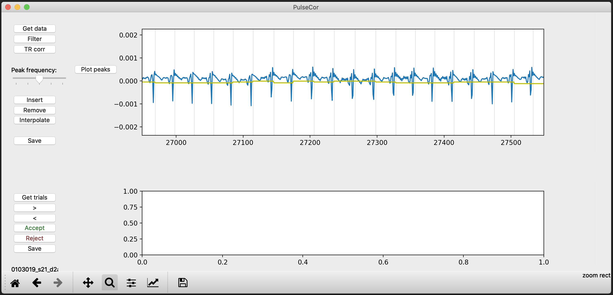
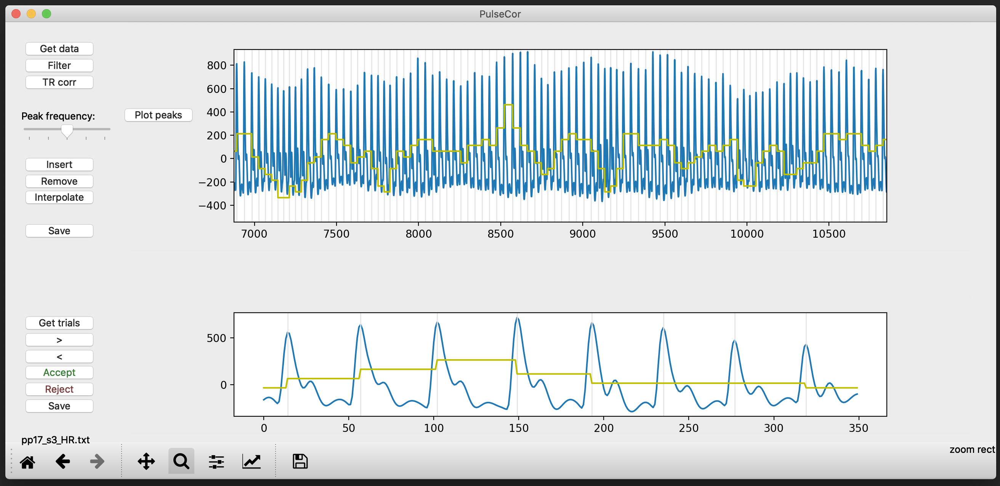

# PulseCor
a simple python-based GUI to preprocess and manually correct heart rate data

You just need to download the "PulseCor_v4.py" file and install the dependencies.

It is a very simply nothing fancy, easy to use GUI to get the peaks of pulse or ecg time course data. You can use the peaks to apply something like RETROICOR to your fMRI data. In addition there is an option to go through the time course on a trial-by-trial basis, for which you need a file containing the times of the markers (eg onset of your stimuli). You can use this to manually accept or reject trial in case the data for that trial is not usable (eg it does not contain detectable peak due to handmovement).

# TIME COURSE
These are the steps you can follow:

1) PulseCor requires the pulse or ECG data to be in a one column text file. See "f_convert_eeg.py" and "f_convert_acq.py" for functions that you can use to convert your files coming from the Brainamp or Biopac.

2) The "Filter" button can be used to filter the data if it is coming from an MRI session fe

3) "Plot peaks" will add gray markers of the peaks that are detected and adds a Inter Beat Interval (IBI) data time course

4) "Peak frequency" slider can be used to change the distance between peak to be detected, you can use this to see if the peak detection gets better with a different freqiuency. It us adviced to do that before starting with manual correcting

5) "Insert" and "Remove" can be used to insert a peak manually or remove one. The way to do this is zoom in to a point where there is one peak visable and the  click "Insert" or "Remove"

6) "Interpolate" can be used if a whole segment of the data is not usable fe because some moved their hand. You can zoom in to the entire section that you want to discard/section that is not usable and click "Interpolate". It will then interpolate the peaks for that section based on the peak frequency before and after that section.

7) "Save" will save the IBI and Peaks in a new file in a folder called "PulseCor_output" which is located in the folder your original file is

> you can save throught the correction and you can even close the file and when re-opening it it will load the IBI and peak files.

# TRIAL DATA
These are the steps you can follow:

1) Select a .txt file that contains one column with times (ie should be in the sample frequency of the time course)

2) With the "<" and ">" arrows you can click though the trials

3) With "Accept" and "Reject" you can accept or reject a trail. If you reject a trial the data will be plotted in gray.

4) "Save" it will output a file with 1 and 0 corresponding with your Accept and Reject decision

This is an example with ECG data:

This is an example with Pulse data:

